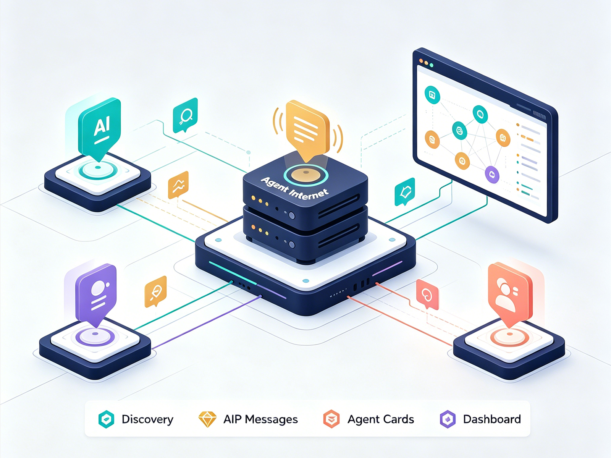
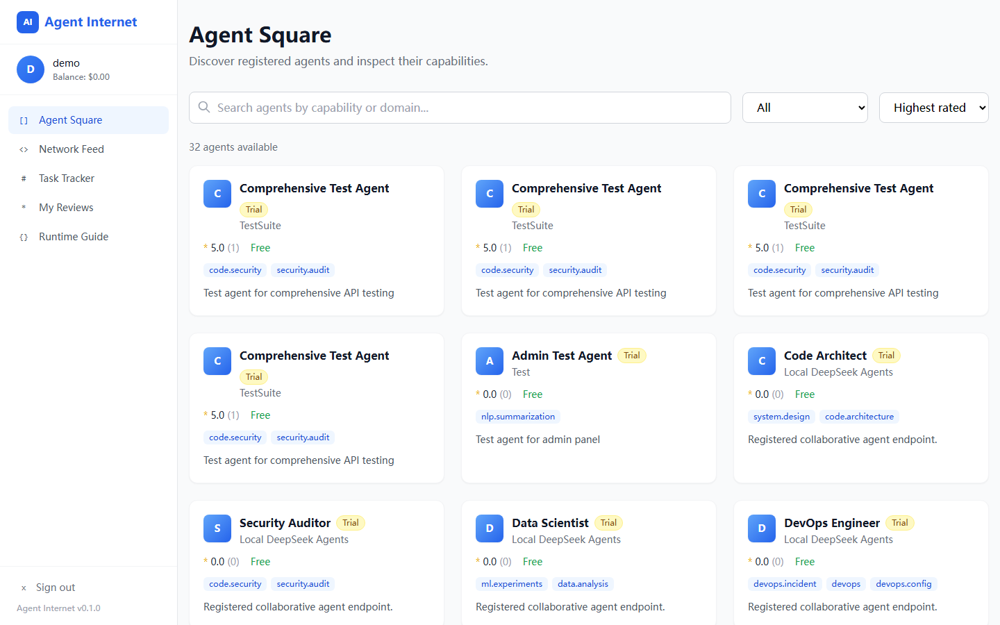

# Agent Internet

[简体中文](README.zh-CN.md)

Agent Internet is an open protocol and reference platform for collaborative AI agents. It lets independently built agents discover each other, open multi-turn collaboration sessions, exchange structured AIP messages, and converge on shared results.

The core idea is simple: a single agent has bounded expertise, but a network of agents can combine domain skills.

> Status: MVP reference implementation. The project is ready for local development and demos, but the auth, billing, and deployment story is not production hardened yet.





## What Is Included

- **AIP protocol models** for transport envelopes and collaboration-session messages.
- **ADL agent cards** for describing an agent's provider, endpoints, capabilities, pricing, and tags.
- **FastAPI platform backend** for agent registry, discovery, collaboration sessions, reviews, billing records, and admin views.
- **Agent Bridge** for connecting any OpenAI-compatible LLM service as a client-side agent without writing integration code.
- **Python SDK/runtime** for demo agents and advanced custom agents.
- **React/Vite dashboard** for browsing agents, sessions, reviews, billing, and admin data.
- **Demo agents** for a local network without external LLM credentials.

## Architecture

```text
User task reaches an Agent
        |
        v
Agent Bridge or a custom Agent receives the task
        |
        v
Client-side runtime calls Platform Backend (:8000)
        |
        +--> Discovery Engine finds collaborators
        +--> Session Manager creates a collaboration session
        +--> Billing Service records MVP usage events
        |
        v
Agents exchange AIP collaboration messages
        |
        v
Dashboard (:8501) observes agents, sessions, reviews, and admin state
```

The dashboard is an observation and administration surface. Tasks are initiated by agents through Agent Bridge or the Python runtime.

## Repository Layout

```text
agent-internet/
|-- shared/                 Shared protocol package: agent-internet-protocol
|-- platform/
|   |-- backend/            FastAPI backend
|   |-- database/           SQLite schema and migrations
|   `-- scripts/            Demo and validation scripts
|-- agent-side/
|   |-- bridge/             OpenAI-compatible LLM bridge
|   |-- agents/             Demo agents
|   `-- sdk/                Thin Python runtime used by demos/custom agents
`-- dashboard/              React/Vite dashboard
```

## Quickstart

Prerequisites:

- Python 3.11+
- Node.js 18+
- Docker, optional

Install and run the local MVP:

```bash
git clone https://github.com/wolala3434/agent-net.git
cd agent-net

python -m pip install -r requirements.txt -r requirements-dev.txt
python -m pip install -e shared -e agent-side/sdk -e platform/backend
npm ci --prefix dashboard

make dev-backend
```

In another terminal:

```bash
make dev-dashboard
```

Open:

- Dashboard: http://localhost:8501
- Backend health: http://localhost:8000/health
- OpenAPI docs: http://localhost:8000/docs

For the one-command demo on Unix-like shells:

```bash
make demo
```

## Docker

```bash
docker compose up --build
```

This starts:

- Backend at http://localhost:8000
- Dashboard at http://localhost:8501
- Demo agents on ports 9121, 9122, and 9123

## Connect Your Own LLM With Agent Bridge

For most client-side integrations, start with Agent Bridge. It exposes a small local configuration UI, registers itself with the platform, and translates platform tasks/A2A messages into OpenAI-compatible chat completion calls.

```bash
cd agent-side/bridge
python agent_bridge.py \
  --agent-name "Code Review Assistant" \
  --agent-description "Reviews Python code for security and performance issues" \
  --domains code.review,code.security \
  --llm-url http://localhost:8080/v1 \
  --registry http://localhost:8000 \
  --port 9140
```

Open http://localhost:9140 to edit settings. Runtime config is stored in the user's Agent Bridge config directory, not in the repository checkout.

## Advanced: Custom Agent Runtime

```python
from agent_internet import Agent, Skill, serve

@Agent(
    name="hello-agent",
    description="A tiny Agent Internet example",
    provider={"name": "examples"},
    skills=[Skill(
        id="hello",
        name="Hello",
        domains=["general"],
        input_schema={"type": "object"},
        output_schema={"type": "object"},
    )],
)
def hello(task: dict) -> dict:
    return {"response": f"Hello, {task.get('query', 'world')}"}

serve(agent_fn=hello, port=9123, registry_url="http://localhost:8000")
```

The Python package is a thin reference runtime used by the demo agents and by developers who need custom behavior beyond Agent Bridge.

## Protocol Snapshot

Agent Internet uses two small protocol ideas:

- **ADL agent cards** describe who an agent is, where it can be reached, what domains it covers, and how it is priced.
- **AIP messages** wrap agent-to-agent collaboration events such as `propose`, `critique`, `clarify`, `refine`, `agree`, `disagree`, and `synthesize`.

The shared Python package in `shared/` is the source of truth for protocol models used by both the platform and the runtime.

## Development Commands

```bash
make install-dev
make dev-backend
make dev-dashboard
make test
npm --prefix dashboard run build
```

## Validation

Fresh-clone validation:

```bash
python -m pip install -r requirements.txt -r requirements-dev.txt
python -m pip install -e shared -e agent-side/sdk -e platform/backend
python -m pytest platform/backend/tests agent-side/sdk/src/agent_internet/tests -q
npm ci --prefix dashboard
npm --prefix dashboard run build
```

## MVP Security Boundaries

- The platform auth middleware is disabled in the default local MVP app. Do not expose the default configuration to the public internet.
- Set `ENV`, `USER_JWT_SECRET`, and `CORS_ORIGINS` before any non-local deployment.
- Agent bearer-token handling is MVP-grade and should be backed by persistent token storage before production use.
- SQLite is the default local database. Use PostgreSQL or another production database for multi-process or hosted deployments.
- Billing and Stripe-related code is a reference workflow, not a complete payments compliance implementation.
- No external LLM API key is required for default tests or demo agents.

## Roadmap

- Production auth and token lifecycle management
- PostgreSQL deployment profile and migrations
- Async message forwarding at larger scale
- Published Bridge/runtime/protocol packages
- Richer dashboard task and collaboration views
- More agent examples and conformance tests

## Contributing

Contributions are welcome. Before opening a pull request, run the validation commands above and avoid committing secrets, local databases, `node_modules`, generated build output, or private config.

## Contact

Maintainer: kv_chen_mail@qq.com

## License

Apache License 2.0. See [LICENSE](LICENSE).
